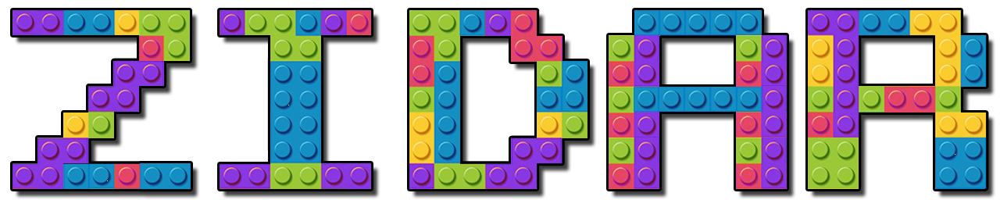

# Zidar - Overview

<p align="center">
  
</p>

Zidar is a Lua-based build system framework built on top of [GENie](https://github.com/bkaradzic/GENie) (a Premake fork). It provides a structured, convention-driven way to define C and C++ projects with automatic dependency resolution, cross-platform toolchain configuration, Qt integration, and embedded shader support. You describe your projects with minimal Lua callbacks and zidar handles the rest — dependency resolution, compiler flags, platform detection, and native build file generation.

## Features

- **Convention over configuration** — projects follow a standard directory layout; zidar automatically discovers source files, public headers, and dependencies without verbose per-file listings
- **Automatic dependency resolution** — recursive dependency discovery with transitive flattening, deduplication via hashing, and topological sorting for GNU Make; resolved results are cached for performance
- **Cross-platform toolchain support** — 30+ platform/compiler combinations including Windows (MSVC 2017–2022, MinGW GCC/Clang), Linux (GCC, Clang, AFL variants), macOS/iOS/tvOS/visionOS (Xcode), Android NDK (arm, arm64, x86, x86_64), WebAssembly (Emscripten), FreeBSD, NetBSD, Raspberry Pi, RISC-V, and consoles (PlayStation 4/5, Xbox One, Nintendo Switch)
- **Qt 6 integration** — automatic MOC, UIC, RCC, and translation file processing with per-project file caching and automatic linking of Qt modules (Core, Gui, Widgets, Network, and custom modules)
- **Embedded shader compilation** — bgfx shaderc integration for cross-compiling shaders to GLSL, SPIR-V, DirectX 9/11, and Metal as a prebuild step
- **3rd party library management** — 63 pre-configured library scripts with automatic git cloning, building, and linking; libraries include bgfx, imgui, assimp, curl, zlib, box2d, jolt, spdlog, and many more
- **Precompiled header support** — automatic detection of `<projectname>_pch.h` / `<projectname>_pch.cpp` in the `src/` directory; can be disabled globally with `--with-no-pch`
- **Seven project types** — libraries (static/shared), command-line tools, games, Qt applications, 3rd party library wrappers, unit tests, samples, and library tools
- **Build configurations** — debug (full symbols), release (optimized with symbols), and retail (fully optimized, no symbols) with appropriate defines and compiler flags
- **Aggressive caching** — ANSI codes, project paths, script lookups, directory listings, language detection, dependency resolution, and Qt file lists are all cached for fast repeated lookups
- **Colored console output** — ANSI-colored build status messages with UTF-8 box drawing characters, configurable color palette, and blink support
- **Deployment and packaging** — platform-specific packaging via `deploy.lua` including icon generation/conversion, manifest creation, and app bundle building for mobile and desktop platforms

## Architecture

Zidar is organized into the following scripts:

| Script | Purpose | Size |
|---|---|---|
| `zidar.lua` | Main entry point — options, globals, dependency resolution, project loading, path caching | ~1230 lines |
| `toolchain.lua` | Compiler/linker flags for 30+ platform/compiler combinations | ~1470 lines |
| `configurations.lua` | Per-project build config (debug/release/retail), vpath mapping for IDE organization | ~80 lines |
| `deploy.lua` | Platform-specific deployment, packaging, manifest generation, icon conversion | ~8400 lines |
| `qtpresets6.lua` | Qt 6 project configuration and prebuild commands | |
| `qtprebuild.lua` | Standalone Qt tool executor (moc, uic, rcc, lrelease) | |
| `embedded_files.lua` | Shader prebuild command generation | |
| `embedded_shader_prebuild.lua` | Standalone shader compilation script | |
| `project_lib.lua` | Library project type — static/shared libs with auto C/C++ detection | |
| `project_game.lua` | Game project type — WindowedApp in retail, ConsoleApp in debug/release | |
| `project_cmdtool.lua` | Command-line tool project type | |
| `project_qt.lua` | Qt application project type | |
| `project_3rd.lua` | 3rd party library wrapper project type | |
| `project_lib_sample.lua` | Library sample project type with automatic bgfx detection | |
| `project_lib_test.lua` | Library unit test project type (unittest-cpp for C++, unity for C) | |
| `project_lib_tool.lua` | Library tool project type | |
| `3rd/*.lua` | 63 third-party library build scripts | |

## How It Works

### Initialization Flow

1. Your `genie.lua` loads `zidar.lua` via `dofile(_OPTIONS["zidar-path"] .. "/zidar.lua")`
2. Zidar displays a colored UTF-8 banner showing the version
3. Path globals are initialized (`RG_ROOT_DIR`, `RG_SCRIPTS_DIR`, `RG_ZIDAR_DIR`, etc.)
4. The `.zidar/` (temp files) and `.3rd/` (dependency cache) directories are established
5. All sub-scripts are loaded (`toolchain.lua`, `configurations.lua`, `project_*.lua`, `deploy.lua`)
6. The 3rd party registry (`RG_3RD_PARTY_SCRIPTS`) is populated with 63 library scripts
7. UTF-8 mode is enabled on startup and disabled on exit via atexit callbacks

### Project Registration

1. You load your project scripts which register global Lua callback functions (e.g. `projectAdd_mylib()`)
2. You create a `solution` and call `setPlatforms()` to configure the toolchain
3. You call `projectAdd()` or `addLibProjects()` which triggers dependency resolution

### Dependency Resolution

1. `projectAdd(name)` calls `projectDependencies_<name>()` to get declared dependencies
2. Each dependency is recursively resolved — transitive dependencies are flattened into a single list
3. A hash table deduplicates entries to prevent duplicate linking
4. For GNU Make, dependencies are sorted by count (deepest-first) for correct link order
5. Results are cached in `g_resolvedDependencies` so repeated lookups are instant
6. `configDependency()` is called for each resolved dependency to apply configuration

### Project Path Discovery

When zidar needs to find a project, it searches in this order:

1. **Cache** — checks `g_projectPathCache` for a previously resolved path
2. **Upward recursive search** — walks up parent directories from the working directory, at each level searching up to 3 subdirectory levels deep for the project. Stops at the filesystem root or the user's home directory. Skips the `zidar/3rd` directory to avoid false matches.
3. **3rd party registry** — checks `RG_3RD_PARTY_SCRIPTS` for a matching library script
4. **Auto-download** — if a `projectSource_<name>()` callback returns a git URL, clones the repository into `.3rd/`

### Build File Generation

GENie generates native build files based on the action specified:

```bash
genie --zidar-path=/path/to/zidar vs2022     # Visual Studio 2022 solution
genie --zidar-path=/path/to/zidar vs2019     # Visual Studio 2019 solution
genie --zidar-path=/path/to/zidar gmake      # GNU Makefiles
genie --zidar-path=/path/to/zidar ninja       # Ninja build files
genie --zidar-path=/path/to/zidar xcode9      # Xcode project
```

## Command-Line Options

| Option | Description |
|---|---|
| `--zidar-path=PATH` | Path to zidar installation directory |
| `--with-unittests` | Generate library unit test projects |
| `--with-tools` | Generate library tool projects |
| `--with-samples` | Generate library sample projects |
| `--with-no-pch` | Disable precompiled headers for all projects |
| `--gcc=VARIANT` | Select GCC/Clang variant (31 options — see Platform Support) |
| `--vs=TOOLSET` | Select Visual Studio toolset variant |
| `--xcode=TARGET` | Select Xcode target (osx, ios, tvos, xros) |
| `--with-android=#` | Set Android platform version (default: 24) |
| `--with-ios=#` | Set iOS target version (default: 13.0) |
| `--with-macos=#` | Set macOS target version (default: 13.0) |
| `--with-tvos=#` | Set tvOS target version (default: 13.0) |
| `--with-visionos=#` | Set visionOS target version (default: 1.0) |
| `--with-windows=#` | Set Windows SDK version |
| `--with-dynamic-runtime` | Link runtime dynamically instead of statically |
| `--with-32bit-compiler` | Use 32-bit compiler instead of 64-bit |
| `--with-avx` | Enable AVX SIMD extensions |
| `--with-glfw` | Link GLFW libraries |
| `--with-remove-crt` | Remove C Runtime from linking (bare-metal/kernel) |

## Platform Support

### GCC Variants (`--gcc=`)

| Category | Variants |
|---|---|
| **Android** | `android-arm`, `android-arm64`, `android-x86`, `android-x86_64` |
| **Linux** | `linux-gcc`, `linux-clang`, `linux-gcc-afl`, `linux-clang-afl` |
| **macOS/Apple** | `osx`, `ios-arm64`, `ios-simulator`, `tvos-arm64`, `tvos-simulator`, `xros-arm64`, `xros-simulator` |
| **Windows** | `mingw-gcc`, `mingw-clang` |
| **WebAssembly** | `wasm`, `wasm2js` |
| **BSD** | `freebsd`, `netbsd` |
| **Embedded** | `rpi`, `riscv64` |
| **Consoles** | `orbis` (PS4), `prospero` (PS5), `nx64` (Switch) |

### Visual Studio Toolsets (`--vs=`)

`vs2017-clang`, `vs2017-xp`, `durango` (Xbox One), `orbis` (PS4), `prospero` (PS5), `winstore100` (UWP)

### Architectures

x64 (default), x86, ARM, ARM64, PPC64LE, RISC-V 64, plus simulator variants for iOS/tvOS/visionOS

## Build Configurations

| Configuration | Defines | Flags | Description |
|---|---|---|---|
| **debug** | `RG_DEBUG_BUILD`, `_DEBUG`, `DEBUG` | Symbols | Full debug symbols, no optimization |
| **release** | `RG_RELEASE_BUILD`, `NDEBUG` | OptimizeSpeed, NoFramePointer, NoBufferSecurityCheck, Symbols | Optimized with debug symbols retained |
| **retail** | `RG_RETAIL_BUILD`, `NDEBUG`, `RETAIL` | OptimizeSpeed, NoFramePointer, NoBufferSecurityCheck | Fully optimized, no debug symbols |

Build targets are suffixed with the configuration name (e.g. `mylib_debug`, `mylib_release`, `mylib_retail`).

## Project Types

| Type | Builder Function | IDE Group | Description |
|---|---|---|---|
| **Library** | `addProject_lib()` | `libs` | Static/shared libraries; auto-detects C vs C++; supports Objective-C++ (.mm) on Apple platforms |
| **Command-line Tool** | `addProject_cmd()` | `tools_cmd` | Console executables with PCH support |
| **Game** | `addProject_game()` | `games` | Game executables; WindowedApp in retail, ConsoleApp otherwise; always includes bgfx |
| **Qt Application** | `addProject_qt()` | `qt` | Qt 6 GUI apps with auto MOC/UIC/RCC/translation processing |
| **3rd Party Library** | `addProject_3rdParty_lib()` | `3rd` | External library wrappers with optional exception support |
| **Unit Test** | `addProject_lib_test()` | `tests` | Test executables; links unittest-cpp (C++) or unity (C) |
| **Sample** | `addProject_lib_sample()` | `samples` | Demo executables named `<lib>_<sample>`, with automatic bgfx dependency detection |
| **Library Tool** | `addProject_lib_tool()` | `libs-tools` | Library-related tool executables named `<lib>_<tool>` |

## Project Callback System

Projects are defined by registering global Lua functions following a naming convention. The project name has dashes and dots replaced with underscores for function names (e.g. `rg-core.lib` → `rg_core_lib`).

| Callback | Required | Purpose |
|---|---|---|
| `projectAdd_<name>()` | Yes | Main project setup — calls the appropriate `addProject_*()` function |
| `projectDependencies_<name>()` | No | Returns a table of dependency project names |
| `projectSource_<name>()` | No | Returns a git URL for auto-downloading the project |
| `projectExtraConfig_<name>()` | No | Additional per-configuration setup (platform-specific flags, etc.) |
| `projectExtraConfigExecutable_<name>()` | No | Additional config applied only to executable targets |
| `projectDependencyConfig_<name>()` | No | Configuration applied to projects that depend on this one |
| `projectDescription_<name>()` | No | Returns a human-readable project description |
| `projectHeaderOnlyLib_<name>` | No | Global variable (not function) — marks a header-only library |

## 3rd Party Library Registry

Zidar ships with 63 pre-configured build scripts for popular C/C++ libraries. Missing dependencies are automatically cloned via git when a `projectSource_<name>()` callback provides a URL.

| Category | Libraries |
|---|---|
| **Graphics/Rendering** | bgfx, bimg, bx, imgui, nanosvg, nanovg, vg_renderer |
| **3D/Mesh** | assimp, cgltf, tinygltf, ufbx, meshoptimizer, tinyspline |
| **Compression** | zlib, zstd, basis_universal, squish, zfp |
| **Audio** | ogg, vorbis |
| **Networking** | curl, usockets, uwebsockets, bnet, librdkafka |
| **Physics** | box2d, jolt |
| **XML/Parsing** | libxml2, tinyxml2, libdom, libsvgtiny |
| **Cryptography** | mbedtls, openssl, wolfssl |
| **Scripting** | lua, minilua |
| **Font** | msdfgen, msdf_atlas_gen, stb (truetype) |
| **Texture** | stb (image), basis_universal, squish |
| **Utilities** | spdlog, enkiTS, tbb, sparsehash, tomlplusplus, xxHash, efsw, raw_pdb |
| **Debugging** | DIA (Debug Interface Access) |
| **Testing** | unittest-cpp, unity |

## Requirements

- [GENie](https://github.com/bkaradzic/GENie) build system generator (in PATH)
- `git` — for downloading 3rd party dependencies
- `make` and/or `ninja` — build tools
- `sed` — required on Windows (via [GnuWin32](https://github.com/Silvenga/GnuWin32-Installer))
- `QTDIR` environment variable — only if using Qt 6 integration
- Lua interpreter — required for Qt prebuild steps

## Conventions

### Directory Layout

Zidar expects projects to follow this layout:

```
project_name/
  include/          -- public headers (auto-added to dependents' include paths)
  src/              -- source files and private headers
  tests/            -- unit test source files (enabled with --with-unittests)
  samples/          -- sample projects, each in a subdirectory (enabled with --with-samples)
  tools/            -- tool projects, each in a subdirectory (enabled with --with-tools)
  3rd/              -- project-specific 3rd party code
  scripts/          -- build scripts (genie.lua, project_name.lua)
```

### Script Location

Zidar searches for project scripts in these subdirectories (in order):
- `scripts/`
- `zidar/`
- `genie/`
- `build/`

### Naming

- Project names may contain letters, numbers, dashes, and dots
- Internally, dashes and dots are replaced with underscores for function names
- Example: project `rg-core.lib` becomes `rg_core_lib` in callback function names

### IDE Virtual Paths

Source files are organized into virtual folders in the IDE:

| VPath | File Types |
|---|---|
| `shaders` | `*.sc` |
| `include` | `*.h`, `*.hpp`, `*.hxx`, `*.inl` |
| `src` | `*.c`, `*.cc`, `*.cxx`, `*.cpp` |
| `qt/generated/ui` | `*_ui.h` |
| `qt/generated/moc` | `*_moc.cpp` |
| `qt/generated/qrc` | `*_qrc.cpp` |
| `qt/translation` | `*.ts` |
| `qt/forms` | `*.ui` |
| `qt/resources` | `*.qrc` |

## Global Variables

After loading `zidar.lua`, the following globals are available:

| Variable | Description |
|---|---|
| `RG_ROOT_DIR` | Absolute path to the project root directory |
| `RG_SCRIPTS_DIR` | Directory containing the zidar scripts |
| `RG_ZIDAR_DIR` | Path to the zidar installation |
| `RG_ZIDAR_BUILD_DIR` | Temporary build files directory (`.zidar`) |
| `RG_DEPENDENCY_DIR` | 3rd party dependencies directory (`.3rd`) |
| `RG_ZIDAR_HOME_DIR` | User's home directory |
| `RG_CORE_COMPAT_DIR` | rg_core compatibility headers path |
| `Version` | Table with `.High` and `.Low` version strings |
| `ZIDAR_DIR_PATH` | Path to zidar installation (alias) |
| `ZIDAR_SOLUTION_NAME` | Current solution name |
| `ZIDAR_PROJECT_DIR` | Current project working directory |
| `ZIDAR_PROJECTS_DIR_LIST` | List of directories to search for projects |

## Samples

Zidar includes five sample projects demonstrating progressively more complex usage:

| Sample | Description |
|---|---|
| `01_hello_world` | Minimal executable — simplest possible zidar project |
| `02_hello_library` | Library with unit tests — demonstrates library creation and test integration |
| `03_tool_using_a_library` | Tool depending on a library — demonstrates dependency resolution |
| `04_Qt_app_using_a_library` | Qt GUI application — demonstrates Qt 6 integration |
| `05_fancy_game_engine` | Multi-project game engine — demonstrates advanced features |

Each sample is self-contained with its own `genie.lua` and can be built standalone:

```bash
cd samples/01_hello_world/
make projgen    # Generate build files
make            # Build
```
